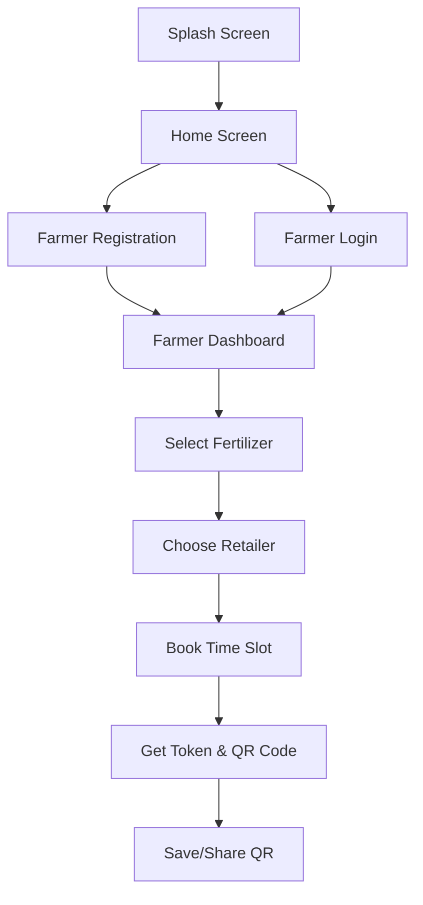

# 🌾 उर्वरक वितरण प्रणाली (Fertilizer Distribution System)

A beautiful, farmer-friendly mobile application for booking fertilizer slots. Built with React Native, Expo, and designed specifically for Indian farmers.


---

## 🎯 Purpose

**Eliminate long queues at PACS (retailer) shops!**

Farmers can:
- Book fertilizer slots in advance
- Choose their preferred time
- Visit the retailer only at the assigned time
- Show QR code or token number for quick pickup

---

## ✨ Features

### For Farmers 👨‍🌾

✅ **Simple Registration** - All fields visible, optional fields clearly marked  
✅ **View Fertilizers** - See available fertilizers with prices and quota  
✅ **Book Slots** - Select quantity and time slot  
✅ **Get Token & QR** - Receive confirmation with QR code  
✅ **Hindi Language** - Everything in Hindi for easy understanding  

### Design Highlights 🎨

✅ **Warm Colors** - Soft purple/pink/peach gradients  
✅ **Large Buttons** - Easy to tap (60px+ height)  
✅ **Clear Text** - Large Hindi fonts (18px+)  
✅ **Rounded Corners** - Friendly, approachable design  
✅ **Soft Shadows** - Gentle depth, not harsh  
✅ **Minimal Screens** - One task per screen  

---

## 📱 Screens Implemented

1. **Splash Screen** - Government branding with Hindi welcome
2. **Home Screen** - 4 large buttons (Farmer/Retailer Registration & Login)
3. **Farmer Registration** - Complete form with Hindi validation
4. **Farmer Login** - Simple mobile + password login
5. **Farmer Dashboard** - Fertilizer cards with quota information
6. **Retailer Selection** - Choose nearby PACS shop
7. **Slot Booking** - Select quantity and time
8. **Token & QR Code** - Booking confirmation with QR

---

## 🚀 Getting Started

### Prerequisites

- Node.js (v14 or later)
- Expo Go app on your mobile device
- npm or yarn

### Installation

Dependencies are already installed! If you need to reinstall:

```bash
npm install
```

### Running the App

**Start the development server:**
```bash
npm start
```

**Scan the QR code:**
- Open Expo Go on your mobile device
- Scan the QR code from the terminal
- App will load on your device!

**Or run on emulators:**
```bash
npm run android    # Android emulator
npm run ios        # iOS simulator (Mac only)
npm run web        # Web browser
```

---

## 🎨 Color Palette

```
Primary Colors:
🟣 Soft Purple: #CE93D8
🌸 Soft Pink: #F48FB1
🍑 Light Peach: #FFF3E0

Accent Colors:
🧡 Soft Orange: #FFB74D
💚 Soft Green: #81C784
🤍 Warm Cream: #FFFBF5
```

---

## 📁 Project Structure

```
New_SFMS_app/
├── src/
│   ├── assets/
│   │   └── images/          # Logo and images
│   ├── components/          # Reusable components
│   │   ├── Button/          # Gradient button with variants
│   │   ├── Card/            # Card with soft shadows
│   │   ├── Input/           # Large input with validation
│   │   └── LoadingSpinner   # Loading indicator
│   ├── screens/
│   │   ├── SplashScreen.tsx
│   │   ├── HomeScreen.tsx
│   │   └── Farmer/          # Farmer flow screens
│   │       ├── FarmerRegistrationScreen.tsx
│   │       ├── FarmerLoginScreen.tsx
│   │       ├── FarmerDashboardScreen.tsx
│   │       ├── RetailerSelectionScreen.tsx
│   │       ├── SlotBookingScreen.tsx
│   │       └── TokenQRScreen.tsx
│   ├── constants/           # Colors, fonts, Hindi text
│   ├── types/               # TypeScript definitions
│   ├── services/            # API layer (ready for backend)
│   └── utils/               # Helper functions
├── App.tsx                  # Main app with navigation
└── package.json
```

---

## 🔄 User Flow



---

## 🛠️ Tech Stack

- **React Native** - Cross-platform mobile framework
- **Expo** - Development and testing platform
- **TypeScript** - Type safety
- **expo-linear-gradient** - Soft gradient backgrounds
- **react-native-qrcode-svg** - QR code generation
- **React Navigation** - Screen navigation (ready to integrate)

---

## 📦 Components

### Button Component
Large, gradient buttons with multiple variants:
- Primary (purple gradient)
- Secondary (pink gradient)
- Outline (border only)
- Loading state support

### Card Component
White cards with rounded corners and soft shadows

### Input Component
- Large touch targets (56px height)
- Hindi labels and placeholders
- Validation error display
- Password toggle
- Icon support

---

## 🌐 Mock Data

The app currently uses realistic mock data for:
- **Fertilizers**: Urea, DAP, NPK with prices and quotas
- **Retailers**: PACS shops with addresses
- **Time Slots**: Available booking times

**Ready for Backend Integration:**
- Type definitions in `src/types/`
- API service layer structure in `src/services/`
- All screens accept dynamic data via props

---

## 📝 Hindi Text Support

All UI text is in Hindi:
- Form labels: नाम, मोबाइल नंबर, पासवर्ड
- Buttons: पंजीकरण करें, लॉगिन करें, स्लॉट बुक करें
- Messages: बुकिंग पूर्ण, कोटा समाप्त
- Validation: Clear error messages in Hindi

---

## ✅ Completed Features

✅ Splash screen with government branding  
✅ Home screen with 4 large navigation buttons  
✅ Farmer registration (all fields visible)  
✅ Farmer login with validation  
✅ Dashboard with fertilizer cards  
✅ Retailer selection list  
✅ Slot booking with quantity + time selection  
✅ Token & QR code generation  
✅ Hindi language throughout  
✅ Form validation with Hindi errors  
✅ Soft gradient color palette  
✅ Large, tappable UI elements  
✅ Reusable component library  

---

## 🔜 Future Enhancements

- [ ] Retailer-side screens (Registration, Login, Dashboard)
- [ ] Interactive tutorial overlay
- [ ] Backend API integration
- [ ] Real authentication with JWT
- [ ] QR code scanning for retailers
- [ ] Booking history
- [ ] Push notifications
- [ ] Multi-language toggle (Hindi/English)
- [ ] Offline mode
- [ ] Analytics dashboard

---

## 📸 Screenshots

> **Note**: Run the app on Expo Go to see all screens in action!

**Screens to explore:**
1. Splash → Beautiful government branding
2. Home → 4 large, clear buttons
3. Registration → All fields visible
4. Dashboard → Fertilizer cards
5. Booking → Time slot selection
6. Token → QR code display

---

## 💡 Design Philosophy

**"Simple, lovable, calm, government-trusted app that respects farmers' time and dignity."**

### Key Principles:

1. **Farmer-First Design**
   - Low digital literacy users in mind
   - No jargon, no complexity
   - Hindi language throughout

2. **Visual Clarity**
   - Large text (18px+)
   - Large buttons (60px+)
   - Clear hierarchy
   - Generous spacing

3. **Warm & Trustworthy**
   - Soft gradient colors
   - Rounded corners everywhere
   - Gentle shadows
   - Government branding

4. **No Surprises**
   - All form fields visible upfront
   - Clear error messages
   - Predictable navigation
   - Consistent layout

---

## 🙏 For Farmers

This app is built with respect for your time and effort. No more long queues. Book your slot, get your fertilizer, go back to farming! 🌾

**किसान सम्मान, समय बचाव, सुविधा प्रथम**

---

## 📄 Documentation

- [Implementation Plan](./brain/implementation_plan.md) - Technical specifications
- [Walkthrough](./brain/walkthrough.md) - Complete feature guide
- [Task Checklist](./brain/task.md) - Development progress

---

## 🤝 Contributing

This app is ready for backend integration! If you want to add features:

1. Check `src/types/` for data structures
2. Add API calls in `src/services/`
3. Update screens with real data
4. Test on Expo Go

---

## 📱 Support

**Tested on:**
- Expo Go (Android & iOS)
- Web browser

**Requirements:**
- Node.js v14+
- Expo CLI
- Mobile device or emulator

---

**Made with ❤️ for Indian Farmers**

**नमस्ते** 🙏
